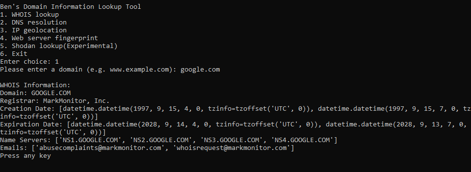
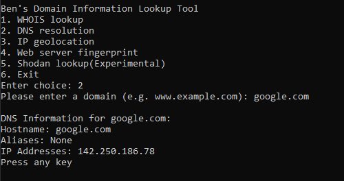
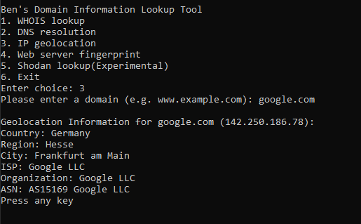
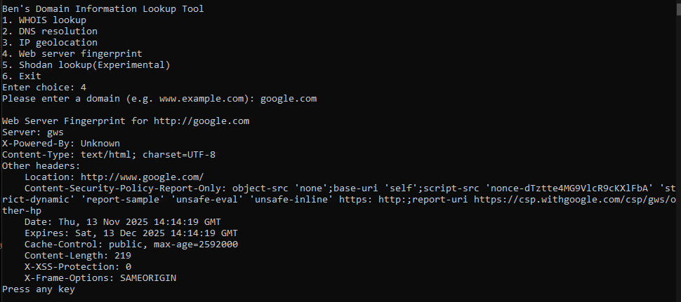
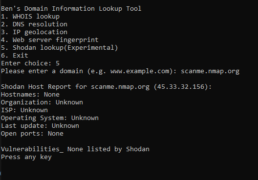

# Domain Information Lookup Tool
For German version of this README, see [README_DE.md](README_DE.md)
Another beginner ``Python script`` that gathers various information
about a given domain.

It currently supports:

- **WHOIS data** - Retrives registrar, creation/expiration dates, name servers and email contact information.
- **DNS resolution** – Resolves a domain to its IP addresses and aliases.
- **IP geolocation** – Uses ip-api.com to fetch geolocation, ISP, and organization data.
- **Server fingerprints** – Inspects HTTP headers for information about server software and technologies.
- **Shodan host reports** – Queries the Shodan API or exposed services, open ports, and potential vulnerabilities (requires an API key).

## Shodan API Info
You'll need a **SHODAN API KEY** for this feature to work.
Unfortunately, this part became a bit too complex for me, and since I don’t blindly copy and paste from ChatGPT,
the Shodan host reports section remains somewhat unreliable and experimental for now.

## Screenshots

