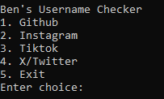
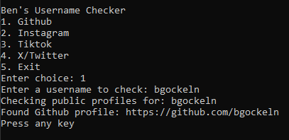

# OSINT Username Checker

This project is a **simple username checker** designed to give beginners hands-on experience with basic OSINT techniques.

The script works by making a **HTTP request** to the server of a selected website and checking the response to determine whether a username exists.

Currently, the supported sites are:

- GitHub: ```https://github.com/<username>```
- TikTok: ```https://www.tiktok.com/@<username>```
- X/Twitter: ```https://www.x.com/<username>```

(Instagram and X/Twitter were tested but may show false positives, so they are not fully reliable.)

## How it works:
1. The user enters a username.
2. The script constructs the URL for the selected website.
3. The script sends a request to the server.
4. The script examines the HTTP status code (200 = exists, 404 = not found, etc.) and, in some cases, a few keywords in the page content to make a best-guess determination.

## Limitations:
- Only public profiles can be reliably detected.
- Instagram and X/Twitter may give false positives due to JavaScript-rendered content or login pages.




